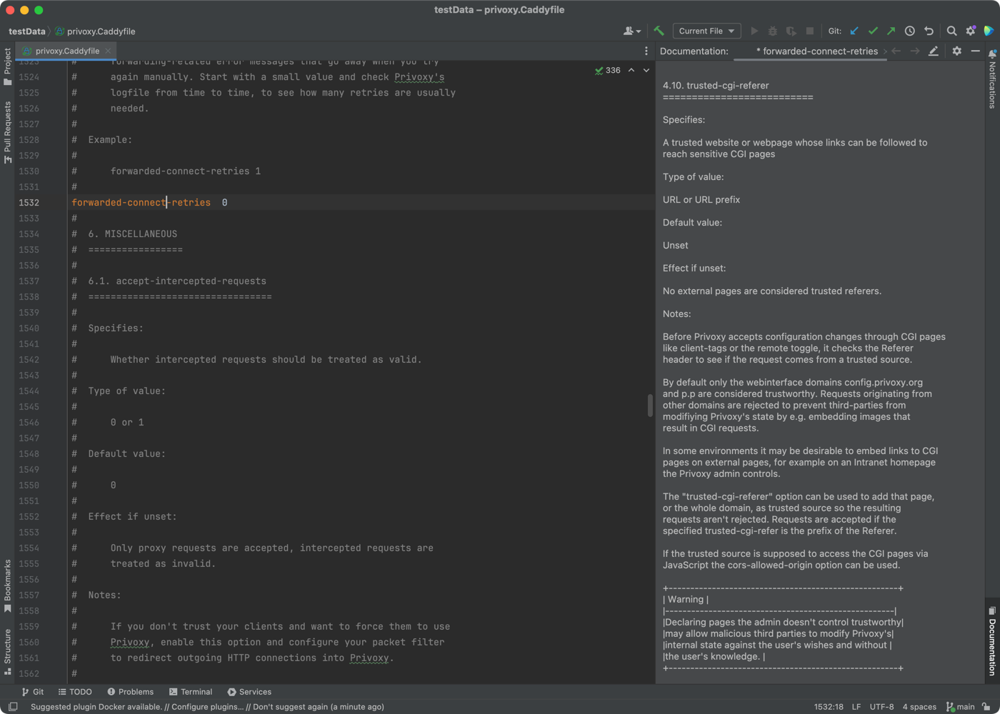
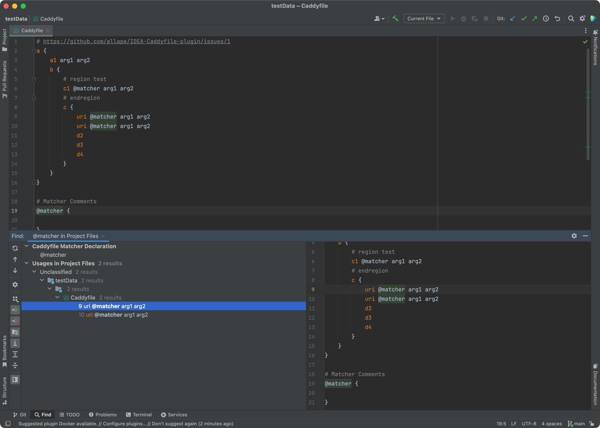
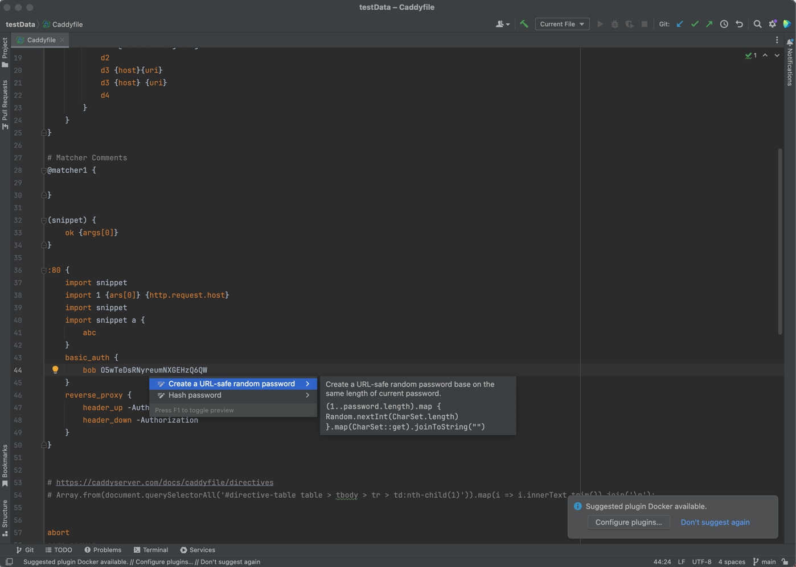

# Caddyfile language support

Supported file types: Caddyfile, Privoxy

## Plugin Marketplace

https://plugins.jetbrains.com/plugin/24642-caddyfile

## Features

- [x] Auto-completion for directives, sub-directives, matchers, snippets, placeholders
- [x] `Find Usage` and `Go To Declaration` for matchers, snippets
- [x] Add documentation dialog for directives, matchers, snippets
- [ ] Multi-files support
- [ ] `Find Usage` and `Go To Declaration` for custom variables with `vars` directive

## Screenshots





## Known Issues

- Goland `Build #GO-243.22562.186` will produce an extra new line when pressing `Enter` after `{`
- Global options block after any no-body directive will be interpolated as a directive block instead of a global block
  - ```caddyfile
    # global block
    {
        debug        
    }
    
    try_files
    
    # should be a global block, but here in PSI tree it is a directive block of `try_files` above
    {
        debug
    }
    ```
- Lack of testing, only tested with simple Caddyfiles
- ICON file may violate legal issue
    - ICON file is copied from https://github.com/caddyserver/caddy/blob/master/README.md, and modified to remove text

## Dev

- Install [Grammar-Kit](https://plugins.jetbrains.com/plugin/6606-grammar-kit) plugin
- Install [Plugin DevKit](https://plugins.jetbrains.com/plugin/22851-plugin-devkit) plugin
- Open [Caddyfile.simple.bnf](src/main/kotlin/cc/allape/caddyfile/Caddyfile.simple.bnf),
  right-click on the editor and select "Generate Parser Code"
- Open [Caddyfile.simple.flex](src/main/kotlin/cc/allape/caddyfile/Caddyfile.simple.flex),
  right-click on the editor and select "Run JFlex Generator"
    - At first time generation, you will be prompted to install `JFlex plugin`
- Run Gradle task `intellij/runIde` to run
    - Or run `intellij/buildPlugin` to build this plugin, and installable zip file will be located
      at [build/distributions](build/distributions)
